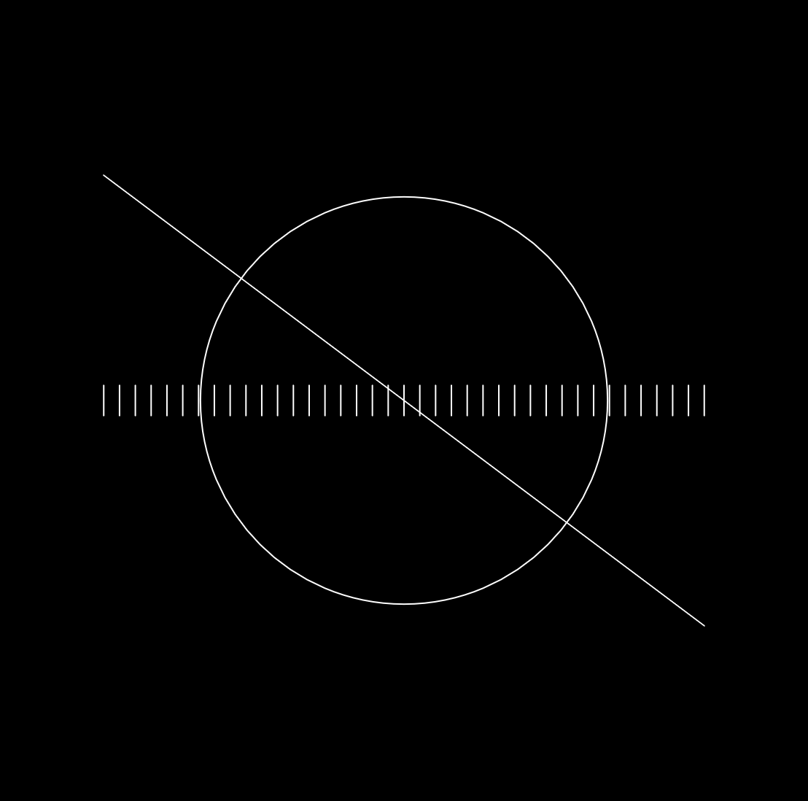
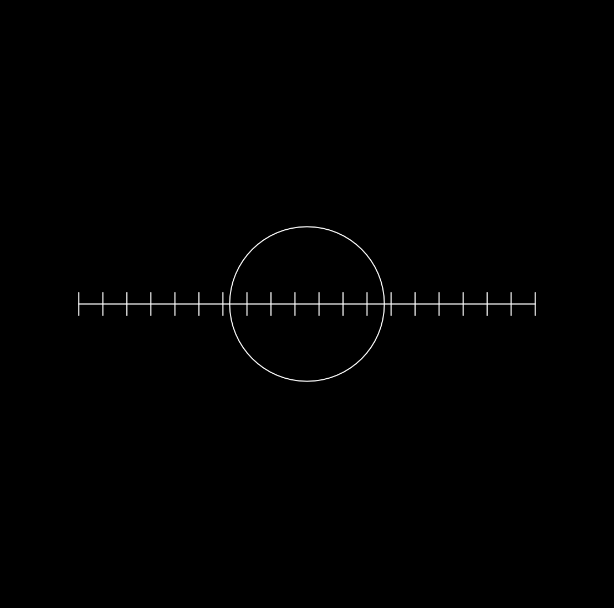
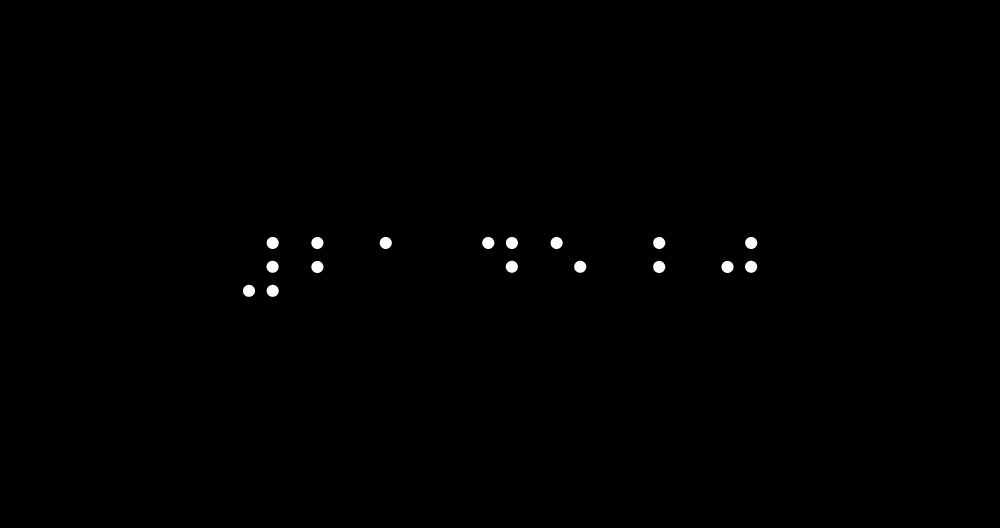
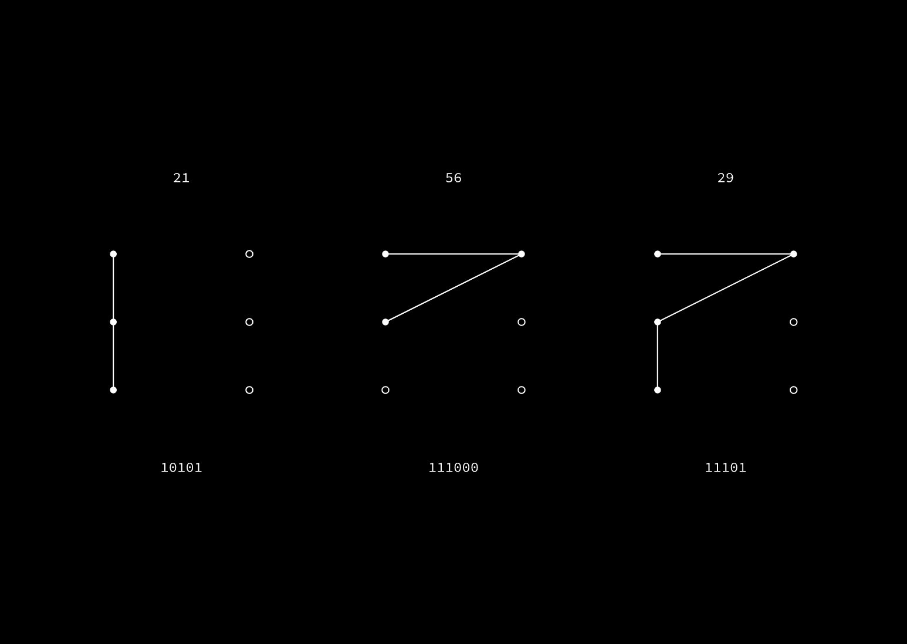

#### :closed_book: [workshop-data-artwork](../README.md) → Time as Data

---

# 🕒 Time as Data

To get familiar with p5.js and CodeSandbox, let's try to create a real-time clock that shows the current time. But, instead of a regular time display, let's treat the numberas as 'data' and try to visualize them in an interesting, novel, abstract, weird, artistic, or fun way.

The graphics should change in sync with the time, so that if you were to look at it at the same time each day, it would appear the same.

#### 📚 References

- [Center Clock by Lee Byron (2007)](http://leebyron.com/centerclock/)
- [Last Clock by Jussi Ängeslevä & Ross Cooper (2002)](http://angesleva.iki.fi/art/last/)
- [Banded Clock by Golan Levin (1999)](http://www.flong.com/projects/clock/)
- [The Coding Train #74: Clock with p5.js](https://www.youtube.com/watch?v=E4RyStef-gY)

#### :bulb: Tips

- Use [`hour()`](https://p5js.org/reference/#/p5/hour), [`minute()`](https://p5js.org/reference/#/p5/minute), [`second()`](https://p5js.org/reference/#/p5/second) from p5.js to get the current time numbers
- Use the [`map()`](https://p5js.org/reference/#/p5/map) function to take the time range (for example 0 - 59 seconds) and scale it to the size of the canvas (for example 0 - `width`)
- Keep it simple!

### 🚀 Starter Template

##### [⟶ Open in CodeSandbox `(p5-clock-template)`](https://codesandbox.io/s/p5-clock-template-r6o9s?file=/sketch.js) 

### 🚀 Example 1 (Beginner)

##### [⟶ Open in CodeSandbox `(p5-clock-abstract)`](https://codesandbox.io/s/p5-abstract-clock-qlf19?file=/sketch.js) 

An abstract and minimal clockface that treats the three numerical data points as inputs to a graphical system:

*Circle radius increases with each second, number of ticks horizontally represent the current number of minutes, and line rotation represents hour of day. 12pm noon results in a flat horizontal line.*

  

> Time at 21:39 and 40s

  

> Time at 12:20 and 20s

### 🚀 Example 2 (Intermediate)

##### [⟶ Open in CodeSandbox `(p5-clock-braille)`](https://codesandbox.io/s/p5-braille-clock-k3t4r?file=/sketch.js)

A minimal clockface that encodes each digit of the current time (hour, second, minute) as a braille symbol.

  

> Time at 21:45 and 20s

### 🚀 Example 3 (Advanced)

##### [⟶ Open in CodeSandbox `(p5-clock-binary)`](https://codesandbox.io/s/p5-binary-clock-rdt5g?file=/sketch.js)

A clockface that encodes each decimal digit in the current time into 6 binary bits of `0` and `1`, drawing a path along a `2x3` grid based on whether the bit is on or off.

> Time at 21:56 and 29s

## 

#### [← Back to README](../README.md)