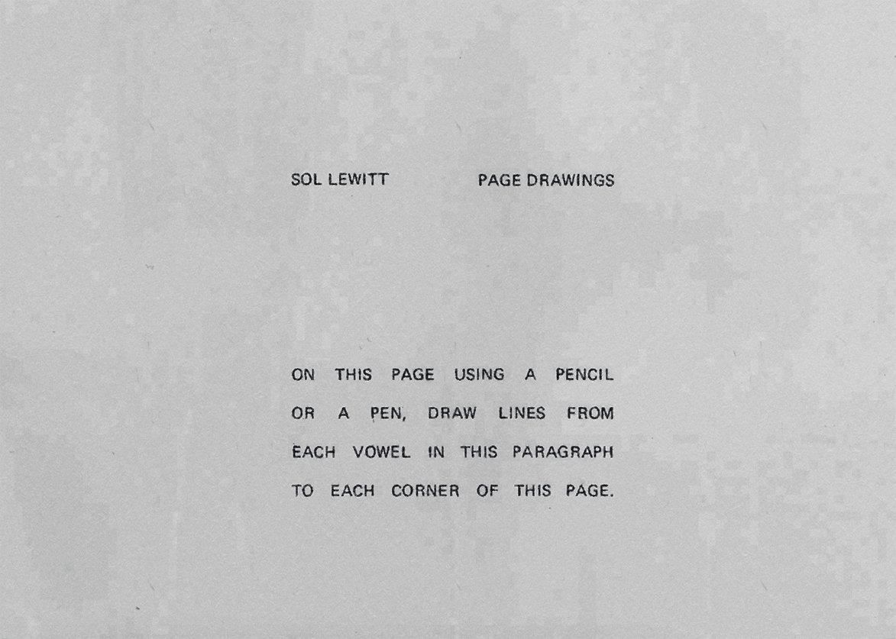
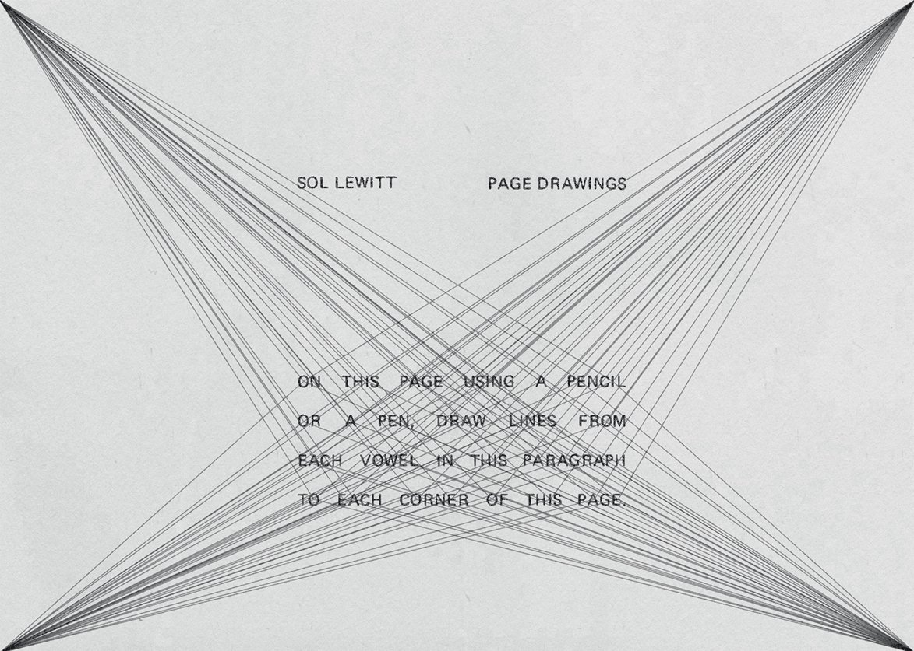
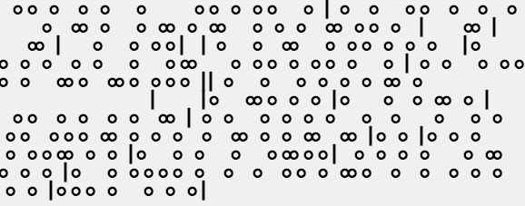
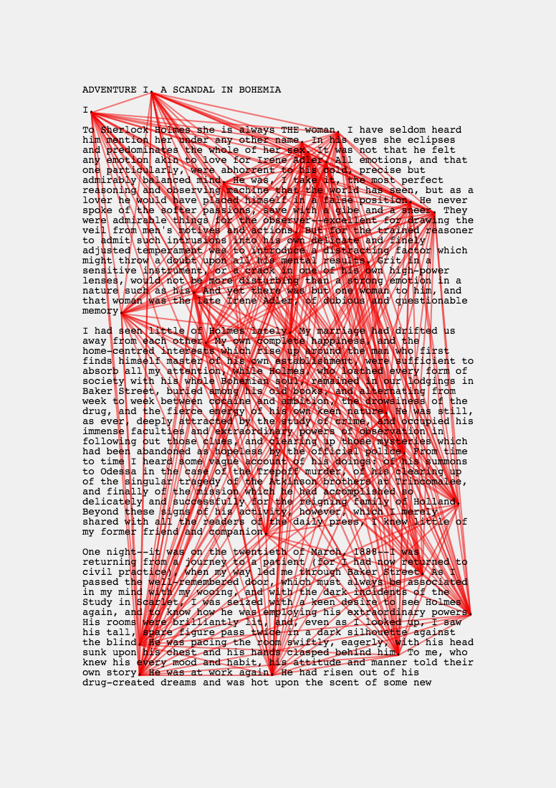
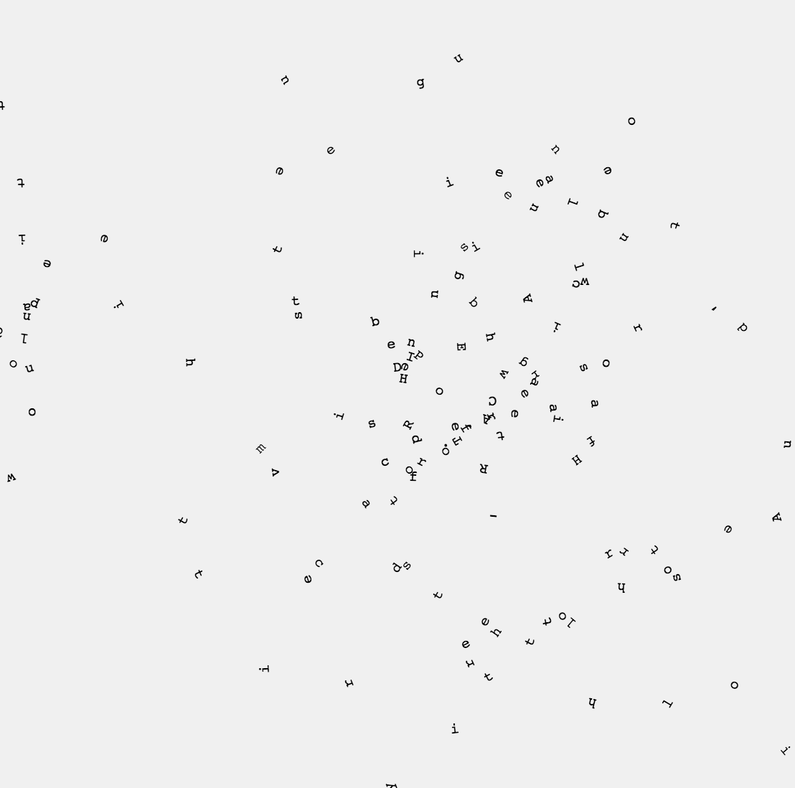
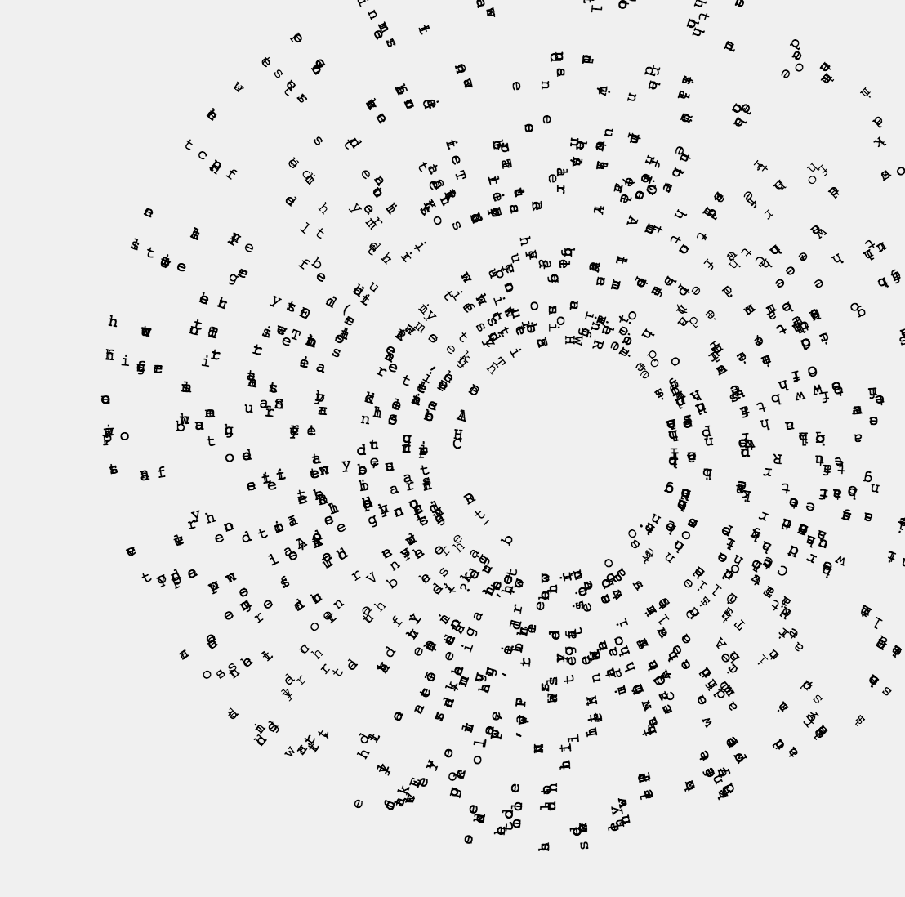

#### :closed_book: [workshop-data-artwork](../README.md) → Language as Data

---

# 📝 Language as Data

To get familiar with loading a file or set of files into our sketch, let's use language data.

Again taking inspiration from Sol LeWitt, see "Page Drawings" (1972), which encouraged the reader to render art directly onto their copy of Avalance Magazine in which LeWitt's instructions were printed:

The basic exercise is to take a piece of text and render it in some graphic way with p5.js, without simply re-drawing the text as-is. For example, you could 'augment' the text as in the above LeWitt exercise, you could work with kinetic typography, you could encode the text as graphic symbols, or you could visualize some aspect of the text.

#### 📚 References

- Designers

  - [Giorgia Lupi](https://giorgialupi.com/data-portraits-at-ted2017)
  - [Stefanie Posavec](http://www.stefanieposavec.com/)
  - [Valentina D'Efilippo](http://www.valentinadefilippo.co.uk/)
  - [Nadieh Bremer](https://www.visualcinnamon.com/)

- Simple JSON Datasets

    - [awesome-json-datasets](https://github.com/jdorfman/awesome-json-datasets)
    - [corpora](https://github.com/dariusk/corpora)
    - [all-the-cities](https://www.npmjs.com/package/all-the-cities)
    - [supervillains](https://www.npmjs.com/package/supervillains) and [superheroes](https://www.npmjs.com/package/superheroes)

#### ⚠️ CodeSandbox Gotcha!

[Here's how](https://codesandbox.io/docs/uploading#ways-to-upload) you upload a file to the sketch.

However, there's currently a bug in CodeSandbox where uploading text files like `.txt` or `.csv` may include unusual characters. To avoid this, use an extension like `.bin`. This is why the assets end in `.book` (they are just plain `.txt` files, renamed). 

#### :bulb: Tips

- Add a [`preload()`](https://p5js.org/reference/#/p5/preload) function to your sketch

  - Here you can use [`loadJSON()`](https://p5js.org/reference/#/p5/loadJSON), [`loadStrings()`](https://p5js.org/reference/#/p5/loadJSON) (text), and [`loadTable()`](https://p5js.org/reference/#/p5/loadJSON) (CSV)

- Draw only a subset of the entire book with `lines = lines.slice(0, 100)`

- Use `const str = lines.join('\n')` to turn a list of lines into a single text string

- Use `const chr = line.charAt(index)` to get a character at a 0-based index

- Use `'!?,.'.includes(chr)` to test if `chr` is any of `'!?,.'` characters (i.e. it's punctuation)

### 🚀 Starter Template

##### [⟶ Open in CodeSandbox `(p5-book-template)`](https://codesandbox.io/s/p5-book-template-jyr0z?file=/sketch.js) 

### 🚀 Example 1 (Beginner/Intermediate)

##### [⟶ Open in CodeSandbox `(p5-book-symbols)`](https://codesandbox.io/s/p5-book-simple-2i1nr?file=/sketch.js) 

Drawing circles for vowels, bars for punctuation.

  

### 🚀 Example 2 (Intermediate)

##### [⟶ Open in CodeSandbox `(p5-book-data-art)`](https://codesandbox.io/s/p5-book-data-art-e3ctf?file=/sketch.js)

Connects all the dots across a page of text, similar to Sol LeWitt's exercise. Uses [`blendMode()`](https://p5js.org/reference/#/p5/blendMode) for multiply blending.

  

### 🚀 Example 3 (Advanced)

##### [⟶ Open in CodeSandbox `(p5-book-kinetic)`](https://codesandbox.io/s/p5-book-kinetic-bwjvx?file=/sketch.js)

An advanced algorithm that maps the first couple dozen lines of the book to a circular structure.

  

During the coding of this, there were some interesting bugs that resulted from incorrect usage of `rotate()`. Try messing with `rotate()` and `translate()` to see if you can recreate this effect!

  

  

### :bulb: Bonus: Color Words

Another thing you might want to try is contrasting multiple datasets, for example loading the `colors/` data in this repository alongside the `books/` data and using it together. I've set up an intermediate level example of this below:

##### [⟶ Open in CodeSandbox `(p5-book-colors)`](https://codesandbox.io/s/p5-book-colors-kx7ug?file=/sketch.js)

## 

#### [← Back to README](../README.md)