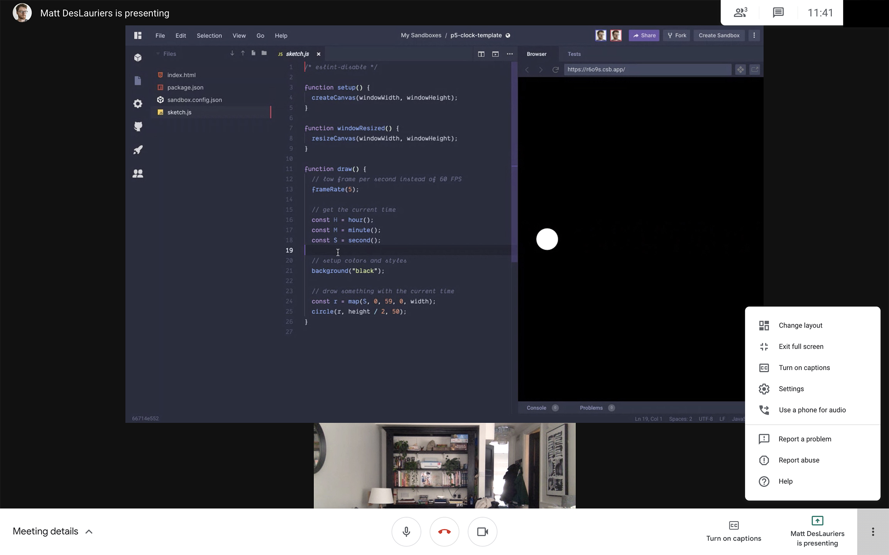
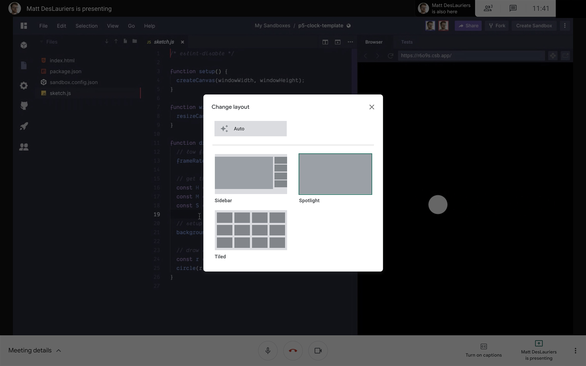

#### :closed_book: [workshop-data-artwork](../README.md) → Fullscreen in Google Meet

---

# Fullscreen in Google Meet

Small tip here: you can change the layout in Google Meet if you want to prioritize seeing me talk, or just my screen/presentation, or a mix of both. Click the Three Dots in the lower right, then **Change Layout**, then **Spotlight** for fullscreen viewing.

## 

#### [← Back to README](../README.md)